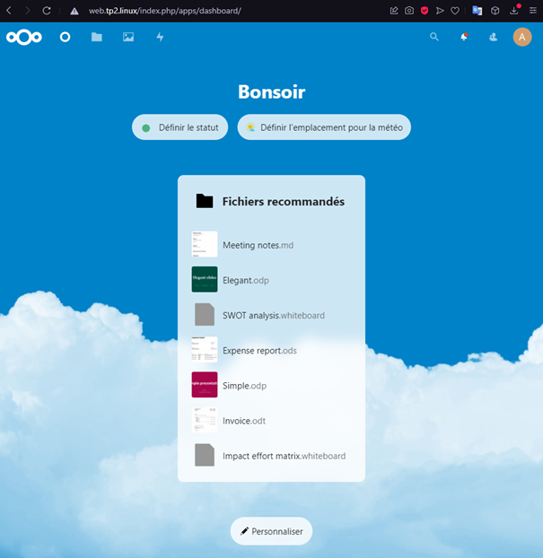

# TP2 pt. 1 : Gestion de service

# Sommaire

- [TP2 pt. 1 : Gestion de service](#tp2-pt-1--gestion-de-service)
- [Sommaire](#sommaire)
- [0. Prérequis](#0-prérequis)
  - [Checklist](#checklist)
- [I. Un premier serveur web](#i-un-premier-serveur-web)
  - [1. Installation](#1-installation)
  - [2. Avancer vers la maîtrise du service](#2-avancer-vers-la-maîtrise-du-service)
- [II. Une stack web plus avancée](#ii-une-stack-web-plus-avancée)
  - [1. Intro](#1-intro)
  - [2. Setup](#2-setup)
    - [A. Serveur Web et NextCloud](#a-serveur-web-et-nextcloud)
    - [B. Base de données](#b-base-de-données)
    - [C. Finaliser l'installation de NextCloud](#c-finaliser-linstallation-de-nextcloud)

# I. Un premier serveur web

## 1. Installation

🖥️ **VM web.tp2.linux**

🌞 **Installer le serveur Apache**

- paquet `httpd`
```
[mathis@web ~]$ sudo dnf install httpd
[...]
Complete!
```

- la conf se trouve dans `/etc/httpd/`
  - le fichier de conf principal est `/etc/httpd/conf/httpd.conf`
  - je vous conseille **vivement** de virer tous les commentaire du fichier, à défaut de les lire, vous y verrez plus clair
    - avec `vim` vous pouvez tout virer avec `:g/^ *#.*/d`

```
[mathis@web ~]$ sudo cat /etc/httpd/conf/httpd.conf
```
```
ServerRoot "/etc/httpd"

Listen 80

Include conf.modules.d/*.conf

User apache
Group apache


ServerAdmin root@localhost


<Directory />
    AllowOverride none
    Require all denied
</Directory>


DocumentRoot "/var/www/html"

<Directory "/var/www">
    AllowOverride None
    Require all granted
</Directory>

<Directory "/var/www/html">
    Options Indexes FollowSymLinks

    AllowOverride None

    Require all granted
</Directory>

<IfModule dir_module>
    DirectoryIndex index.html
</IfModule>

<Files ".ht*">
    Require all denied
</Files>

ErrorLog "logs/error_log"

LogLevel warn

<IfModule log_config_module>
    LogFormat "%h %l %u %t \"%r\" %>s %b \"%{Referer}i\" \"%{User-Agent}i\"" combined
    LogFormat "%h %l %u %t \"%r\" %>s %b" common

    <IfModule logio_module>
      LogFormat "%h %l %u %t \"%r\" %>s %b \"%{Referer}i\" \"%{User-Agent}i\" %I %O" combinedio
    </IfModule>


    CustomLog "logs/access_log" combined
</IfModule>

<IfModule alias_module>


    ScriptAlias /cgi-bin/ "/var/www/cgi-bin/"

</IfModule>

<Directory "/var/www/cgi-bin">
    AllowOverride None
    Options None
    Require all granted
</Directory>

<IfModule mime_module>
    TypesConfig /etc/mime.types

    AddType application/x-compress .Z
    AddType application/x-gzip .gz .tgz


    AddType text/html .shtml
    AddOutputFilter INCLUDES .shtml
</IfModule>

AddDefaultCharset UTF-8

<IfModule mime_magic_module>
    MIMEMagicFile conf/magic
</IfModule>


EnableSendfile on

IncludeOptional conf.d/*.conf
```

🌞 **Démarrer le service Apache**

- le service s'appelle `httpd` (raccourci pour `httpd.service` en réalité)
  - démarrez le
  ```
  [mathis@web ~]$ sudo systemctl start httpd
  ```
  - faites en sorte qu'Apache démarre automatique au démarrage de la machine
  ```
  [mathis@web ~]$ sudo systemctl enable httpd
    Created symlink /etc/systemd/system/multi-user.target.wants/httpd.service → /usr/lib/systemd/system/httpd.service.
  ```
  - ouvrez le port firewall nécessaire
    ```
    [mathis@web ~]$ sudo firewall-cmd --add-port=80/tcp --permanent
    success
    ```
    ```
    [mathis@web ~]$ sudo firewall-cmd --reload
    [sudo] password for mathis:
    success
    ```
    - utiliser une commande `ss` pour savoir sur quel port tourne actuellement Apache
    ```
    [mathis@web ~]$ sudo ss -alnpt
    State         Recv-Q        Send-Q               Local Address:Port                Peer Address:Port        Process
    LISTEN        0             128                        0.0.0.0:22                       0.0.0.0:*
    users:(("sshd",pid=752,fd=5))
    LISTEN        0             128                              *:80                             *:*
    users:(("httpd",pid=1402,fd=4),("httpd",pid=1401,fd=4),("httpd",pid=1400,fd=4),("httpd",pid=1398,fd=4))
    LISTEN        0             128                           [::]:22                          [::]:*
    users:(("sshd",pid=752,fd=7))
    ```

🌞 **TEST**

- vérifier que le service est démarré
    ```
    [mathis@web ~]$ sudo systemctl status httpd
    ● httpd.service - The Apache HTTP Server
    Loaded: loaded (/usr/lib/systemd/system/httpd.service; enabled; vendor preset: disabled)
    Active: active (running) since Wed 2021-09-29 16:45:01 CEST; 12s ago
        Docs: man:httpd.service(8)
    Main PID: 1398 (httpd)
    Status: "Running, listening on: port 80"
        Tasks: 213 (limit: 11385)
    Memory: 29.5M
    CGroup: /system.slice/httpd.service
            ├─1398 /usr/sbin/httpd -DFOREGROUND
            ├─1399 /usr/sbin/httpd -DFOREGROUND
            ├─1400 /usr/sbin/httpd -DFOREGROUND
            ├─1401 /usr/sbin/httpd -DFOREGROUND
            └─1402 /usr/sbin/httpd -DFOREGROUND

    Sep 29 16:45:01 web.tp2.linux systemd[1]: Starting The Apache HTTP Server...
    Sep 29 16:45:01 web.tp2.linux systemd[1]: Started The Apache HTTP Server.
    Sep 29 16:45:01 web.tp2.linux httpd[1398]: Server configured, listening on: port 80
    ```
- vérifier qu'il est configuré pour démarrer automatiquement
    ```
    [mathis@web ~]$ systemctl is-enabled httpd.service
    enabled
    ```
- vérifier avec une commande `curl localhost` que vous joignez votre serveur web localement
    ```
    [mathis@web ~]$ curl 10.102.1.11:80
    <!doctype html>
    <html>
    <head>
        <meta charset='utf-8'>
        <meta name='viewport' content='width=device-width, initial-scale=1'>
        <title>HTTP Server Test Page powered by: Rocky Linux</title>
        <style type="text/css">
        /*<![CDATA[*/

        html {
            height: 100%;
            width: 100%;
        }
    [...]
    ```
- vérifier avec votre navigateur (sur votre PC) que vous accéder à votre serveur web
    Le serveur Web fonctionne bien depuis ma machine Windows.
    ```
    PS C:\Users\Mathis> curl 10.102.1.11:80
    curl : HTTP Server Test Page
    ```
## 2. Avancer vers la maîtrise du service

🌞 **Le service Apache...**

- donnez la commande qui permet d'activer le démarrage automatique d'Apache quand la machine s'allume
    ```
    [mathis@web ~]$ chkconfig httpd on
    Note: Forwarding request to 'systemctl enable httpd.service'.
    ==== AUTHENTICATING FOR org.freedesktop.systemd1.manage-unit-files ====
    Authentication is required to manage system service or unit files.
    Authenticating as: mathis
    Password:
    ==== AUTHENTICATION COMPLETE ====
    ==== AUTHENTICATING FOR org.freedesktop.systemd1.reload-daemon ====
    Authentication is required to reload the systemd state.
    Authenticating as: mathis
    Password:
    ==== AUTHENTICATION COMPLETE ====
    ```
- prouvez avec une commande qu'actuellement, le service est paramétré pour démarré quand la machine s'allume
    ```
    [mathis@web ~]$ systemctl list-unit-files
    UNIT FILE                                  STATE
    [...]
    httpd.service                              enabled
    ```
- affichez le contenu du fichier `httpd.service` qui contient la définition du service Apache
```
ServerRoot "/etc/httpd"

Listen 80

Include conf.modules.d/*.conf

User apache
Group apache


ServerAdmin root@localhost


<Directory />
    AllowOverride none
    Require all denied
</Directory>


DocumentRoot "/var/www/html"

<Directory "/var/www">
    AllowOverride None
    Require all granted
</Directory>

<Directory "/var/www/html">
    Options Indexes FollowSymLinks

    AllowOverride None

    Require all granted
</Directory>

<IfModule dir_module>
    DirectoryIndex index.html
</IfModule>

<Files ".ht*">
    Require all denied
</Files>

ErrorLog "logs/error_log"

LogLevel warn

<IfModule log_config_module>
    LogFormat "%h %l %u %t \"%r\" %>s %b \"%{Referer}i\" \"%{User-Agent}i\"" combined
    LogFormat "%h %l %u %t \"%r\" %>s %b" common

    <IfModule logio_module>
      LogFormat "%h %l %u %t \"%r\" %>s %b \"%{Referer}i\" \"%{User-Agent}i\" %I %O" combinedio
    </IfModule>


    CustomLog "logs/access_log" combined
</IfModule>

<IfModule alias_module>


    ScriptAlias /cgi-bin/ "/var/www/cgi-bin/"

</IfModule>

<Directory "/var/www/cgi-bin">
    AllowOverride None
    Options None
    Require all granted
</Directory>

<IfModule mime_module>
    TypesConfig /etc/mime.types

    AddType application/x-compress .Z
    AddType application/x-gzip .gz .tgz


    AddType text/html .shtml
    AddOutputFilter INCLUDES .shtml
</IfModule>

AddDefaultCharset UTF-8

<IfModule mime_magic_module>
    MIMEMagicFile conf/magic
</IfModule>


EnableSendfile on

IncludeOptional conf.d/*.conf
```

🌞 **Déterminer sous quel utilisateur tourne le processus Apache**

- mettez en évidence la ligne dans le fichier de conf qui définit quel user est utilisé
    dans httpd.conf:
    ```
    User apache
    ```
- utilisez la commande `ps -ef` pour visualiser les processus en cours d'exécution et confirmer que apache tourne bien sous l'utilisateur mentionné dans le fichier de conf
    ```
    [mathis@web conf]$ ps -ef
    UID          PID    PPID  C STIME TTY          TIME CMD
    [...]
    apache       776     744  0 12:36 ?        00:00:00 /usr/sbin/httpd -DFOREGROUND
    apache       777     744  0 12:36 ?        00:00:03 /usr/sbin/httpd -DFOREGROUND
    apache       778     744  0 12:36 ?        00:00:04 /usr/sbin/httpd -DFOREGROUND
    apache       779     744  0 12:36 ?        00:00:03 /usr/sbin/httpd -DFOREGROUND
    ```
- la page d'accueil d'Apache se trouve dans `/usr/share/testpage/`
  - vérifiez avec un ls -al que tout son contenu est accessible à l'utilisateur mentionné dans le fichier de conf
    ```
    [mathis@web testpage]$ ls -al
    total 12
    drwxr-xr-x.  2 root root   24 Sep 29 16:31 .
    drwxr-xr-x. 91 root root 4096 Sep 29 16:31 ..
    -rw-r--r--.  1 root root 7621 Jun 11 17:23 index.html
    ```

🌞 **Changer l'utilisateur utilisé par Apache**

- créez le nouvel utilisateur
```
[mathis@web ~]$ sudo useradd mapache -m -d /usr/share/httpd -s /sbin/nologin
```
  - pour les options de création, inspirez-vous de l'utilisateur Apache existant
    - le fichier `/etc/passwd` contient les informations relatives aux utilisateurs existants sur la machine
    - servez-vous en pour voir la config actuelle de l'utilisateur Apache par défaut
- modifiez la configuration d'Apache pour qu'il utilise ce nouvel utilisateur
changement des lignes:
```
User mapache
Group mapache
```
- redémarrez Apache
```
[mathis@web ~]$ systemctl reload httpd
==== AUTHENTICATING FOR org.freedesktop.systemd1.manage-units ====
Authentication is required to reload 'httpd.service'.
Authenticating as: mathis
Password:
==== AUTHENTICATION COMPLETE ====
```
- utilisez une commande `ps` pour vérifier que le changement a pris effet
```
[mathis@web ~]$ ps -ef
UID          PID    PPID  C STIME TTY          TIME CMD
mapache     1690     749  0 15:32 ?        00:00:00 /usr/sbin/httpd -DFOREGROUND
mapache     1691     749  0 15:32 ?        00:00:00 /usr/sbin/httpd -DFOREGROUND
mapache     1692     749  0 15:32 ?        00:00:00 /usr/sbin/httpd -DFOREGROUND
mapache     1693     749  0 15:32 ?        00:00:00 /usr/sbin/httpd -DFOREGROUND
```

🌞 **Faites en sorte que Apache tourne sur un autre port**

- modifiez la configuration d'Apache pour lui demande d'écouter sur un autre port 
    ```
    Dans le fichier httpd.conf, j'ai modifié la ligne "Listen 80" en "Listen 69".
    ```

- ouvrez un nouveau port firewall, et fermez l'ancien
    ```
    [mathis@web conf]$ sudo firewall-cmd --add-port=69/tcp --permanent
    success
    [mathis@web conf]$ sudo firewall-cmd --remove-port=80/tcp --permanent
    success
    [mathis@web conf]$ sudo firewall-cmd --reload
    success
    [mathis@web conf]$ sudo firewall-cmd --list-all
    [...]
    ports: 22/tcp 69/tcp
    ```
- redémarrez Apache
    ```
    [mathis@web conf]$ systemctl reload httpd
    ==== AUTHENTICATING FOR org.freedesktop.systemd1.manage-units ====
    Authentication is required to reload 'httpd.service'.
    Authenticating as: mathis
    Password:
    ==== AUTHENTICATION COMPLETE ====
    ```
- prouvez avec une commande `ss` que Apache tourne bien sur le nouveau port choisi
    ```
    [mathis@web conf]$   sudo ss -alnpt
    State                 Recv-Q                Send-Q                               Local Address:Port                               Peer Address:Port                Process
    [...]
    LISTEN                0                     128                                              *:69                                            *:*                    users:(("httpd",pid=2223,fd=9),("httpd",pid=2222,fd=9),("httpd",pid=2221,fd=9),("httpd",pid=749,fd=9))
    ```
- vérifiez avec `curl` en local que vous pouvez joindre Apache sur le nouveau port
    ```
    [mathis@web conf]$ curl 10.102.1.11:69
    <!doctype html>
    <html>
    <head>
        <meta charset='utf-8'>
        <meta name='viewport' content='width=device-width, initial-scale=1'>
        <title>HTTP Server Test Page powered by: Rocky Linux</title>
        <style type="text/css">
        /*<![CDATA[*/
    [...]
    [...]
    ```
- vérifiez avec votre navigateur que vous pouvez joindre le serveur sur le nouveau port
    ```
    PS C:\Users\Mathis> curl 10.102.1.11:69
    curl : HTTP Server Test Page
    This page is used to test the proper operation of an HTTP server after it has been installed on a Rocky Linux system. If you can read this page, it means that the software it working correctly.
    Just visiting?
    This website you are visiting is either experiencing problems or could be going through maintenance.
    If you would like the let the administrators of this website know that you've seen this page instead of the page you've expected, you should send them an email. In general, mail sent to the name "webmaster"
    and directed to the website's domain should reach the appropriate person.
    The most common email address to send to is: "webmaster@example.com"
    Note:
    The Rocky Linux distribution is a stable and reproduceable platform based on the sources of Red Hat Enterprise Linux (RHEL). With this in mind, please understand that:
    Neither the Rocky Linux Project nor the Rocky Enterprise Software Foundation have anything to do with this website or its content.
    The Rocky Linux Project nor the RESF have "hacked" this webserver: This test page is included with the distribution.
    For more information about Rocky Linux, please visit the Rocky Linux website.
    I am the admin, what do I do?
    You may now add content to the webroot directory for your software.
    For systems using the Apache Webserver: You can add content to the directory /var/www/html/. Until you do so, people visiting your website will see this page. If you would like this page to not be shown,
    follow the instructions in: /etc/httpd/conf.d/welcome.conf.
    For systems using Nginx: You can add your content in a location of your choice and edit the root configuration directive in /etc/nginx/nginx.conf.

    Apache™ is a registered trademark of the Apache Software Foundation in the United States and/or other countries.
    NGINX™ is a registered trademark of F5 Networks, Inc..
    ```

📁 [**Fichier `/etc/httpd/conf/httpd.conf`**](/LINUX/httpd.conf)
# II. Une stack web plus avancée

## 1. Intro

[...]

## 2. Setup

🖥️ **VM db.tp2.linux**

### A. Serveur Web et NextCloud

**Créez les 2 machines et déroulez la [📝**checklist**📝](#checklist).**

🌞 Install du serveur Web et de NextCloud sur `web.tp2.linux`

- n'oubliez pas de réinitialiser votre conf Apache avant de continuer
  - remettez le port et le user par défaut en particulier
- déroulez [la doc d'install de Rocky](https://docs.rockylinux.org/guides/cms/cloud_server_using_nextcloud/#next-steps)
  - **uniquement pour le serveur Web + NextCloud**, vous ferez la base de données MariaDB après
  - quand ils parlent de la base de données, juste vous sautez l'étape, on le fait après :)
- je veux dans le rendu **toutes** les commandes réalisées
  - n'oubliez pas la commande `history` qui permet de voir toutes les commandes tapées précédemment

Une fois que vous avez la page d'accueil de NextCloud sous les yeux avec votre navigateur Web, **NE VOUS CONNECTEZ PAS** et continuez le TP
```
   30  dnf module enable php:remi-7.4
   31  sudo dnf module enable php:remi-7.4
   32  dnf module list php
   33  dnf install httpd mariadb-server vim wget zip unzip libxml2 openssl php74-php php74-php-ctype php74-php-curl php74-php-gd php74-php-iconv php74-php-json php74-php-libxml php74-php-mbstring php74-php-openssl php74-php-posix php74-php-session php74-php-xml php74-php-zip php74-php-zlib php74-php-pdo php74-php-mysqlnd php74-php-intl php74-php-bcmath php74-php-gmp
   35  systemctl enable httpd
   39  sudo dnf install httpd php
   41  sudo mkdir /etc/httpd/sites-available
   42  sudo mkdir /etc/httpd/sites-enabled
   43  sudo mkdir /var/www/sub-domains/
   44  sudo vim /etc/httpd/conf/httpd.conf
   45  sudo vim /etc/httpd/sites-available/linux.tp2.web
   46  sudo ln -s /etc/httpd/sites-available/linux.tp2.web /etc/httpd/sites-enabled/
   47  ls /etc/httpd/sites-enabled/
   48  ls /var/www/sub-domains/
   49  sudo mkdir -p /var/www/sub-domains/linux.tp2.web/html
   50  cd /usr/share/zoneinfo
   51  sudo vim /etc/opt/remi/php74/php.ini
   52  ls -al /etc/localtime
   53  cd
   54  sudo wget https://download.nextcloud.com/server/releases/nextcloud-21.0.1.zip
   55  sudo unzip nextcloud-21.0.1.zip
   56  cd nextcloud
   58  sudo cp -Rf * /var/www/sub-domains/linux.tp2.web/html/
   59  chown -Rf apache:apache /var/www/sub-domains/linux.tp2.web/html
   60  ls -al /var/www/sub-domains/linux.tp2.web/html/
   75  sudo chgrp -R apache linux.tp2.web/
   76  sudo chown -R apache linux.tp2.web/
   77  sudo systemctl restart httpd
   78  sudo systemctl status httpd
   79  sudo firewall-cmd --reload
   80  sudo systemctl status httpd
   81  ls -al
   85  cd /etc/httpd/conf
   86  cat httpd.conf
   87  cd /etc/httpd/sites-available/
   88  ls
   89  cat linux.tp2.web
   93  sudo cat /var/log/httpd/error_log
   94  sudo systemctl restart https
   95  sudo systemctl restart httpd
   96  sudo systemctl status httpd
```

📁 [**Fichier `/etc/httpd/conf/httpd.conf`**](LINUX\TP2\conf_nextcloud_web)
📁 [**Fichier `/etc/httpd/sites-available/web.tp2.linux`**](LINUX\TP2\conf_nextcloud_web)

### B. Base de données

🌞 **Install de MariaDB sur `db.tp2.linux`**

- déroulez [la doc d'install de Rocky](https://docs.rockylinux.org/guides/database/database_mariadb-server/)
- manipulation 
- je veux dans le rendu **toutes** les commandes réalisées
```
   14  sudo dnf install mariadb-server
   15  sudo systemctl enable mariadb
   16  sudo systemctl start mariadb
   17  sudo mysql_secure_installation
```
- vous repérerez le port utilisé par MariaDB avec une commande `ss` exécutée sur `db.tp2.linux`
```
[mathis@db ~]$ ss -alpnt
State      Recv-Q     Send-Q          Local Address:Port           Peer Address:Port     Process
LISTEN     0          128                   0.0.0.0:22                  0.0.0.0:*
LISTEN     0          80                          *:3306                      *:*
LISTEN     0          128                      [::]:22                     [::]:*
```

🌞 **Préparation de la base pour NextCloud**

- une fois en place, il va falloir préparer une base de données pour NextCloud :
  - connectez-vous à la base de données à l'aide de la commande `sudo mysql -u root`
  - exécutez les commandes SQL suivantes :

```
[mathis@db ~]$ sudo mysql -u root -p
[sudo] password for mathis:
Enter password:
Welcome to the MariaDB monitor.  Commands end with ; or \g.
Your MariaDB connection id is 18
Server version: 10.3.28-MariaDB MariaDB Server

Copyright (c) 2000, 2018, Oracle, MariaDB Corporation Ab and others.

Type 'help;' or '\h' for help. Type '\c' to clear the current input statement.

MariaDB [(none)]> CREATE USER 'nextcloud'@'10.102.1.11' IDENTIFIED BY 'meow';
Query OK, 0 rows affected (0.000 sec)

MariaDB [(none)]> CREATE DATABASE IF NOT EXISTS nextcloud CHARACTER SET utf8mb4 COLLATE utf8mb4_general_ci;
Query OK, 1 row affected (0.000 sec)

MariaDB [(none)]> GRANT ALL PRIVILEGES ON nextcloud.* TO 'nextcloud'@'10.102.1.11';
Query OK, 0 rows affected (0.000 sec)

MariaDB [(none)]> FLUSH PRIVILEGES;
Query OK, 0 rows affected (0.000 sec)
```

🌞 **Exploration de la base de données**

- afin de tester le bon fonctionnement de la base de données, vous allez essayer de vous connecter, comme NextCloud le fera :
  - depuis la machine `web.tp2.linux` vers l'IP de `db.tp2.linux`
  - vous pouvez utiliser la commande `mysql` pour vous connecter à une base de données depuis la ligne de commande
    - par exemple `mysql -u <USER> -h <IP_DATABASE> -p`
    ```
    [mathis@web ~]$ mysql -u nextcloud -h 10.102.1.12 -pmeow
    Welcome to the MariaDB monitor.  Commands end with ; or \g.
    Your MariaDB connection id is 24
    Server version: 10.3.28-MariaDB MariaDB Server

    Copyright (c) 2000, 2018, Oracle, MariaDB Corporation Ab and others.

    Type 'help;' or '\h' for help. Type '\c' to clear the current input statement.

    MariaDB [(none)]>
    ```
- utilisez les commandes SQL fournies ci-dessous pour explorer la base

```
MariaDB [(none)]> SHOW DATABASES;
+--------------------+
| Database           |
+--------------------+
| information_schema |
| nextcloud          |
+--------------------+
2 rows in set (0.001 sec)

MariaDB [(none)]> USE nextcloud;
Database changed
MariaDB [nextcloud]> SHOW TABLES;
Empty set (0.001 sec)
```

- trouver une commande qui permet de lister tous les utilisateurs de la base de données

```
MariaDB [nextcloud]> SELECT user FROM mysql.user;
ERROR 1142 (42000): SELECT command denied to user 'nextcloud'@'10.102.1.11' for table 'user'
```
Mon utilisateur n'a pas les droits d'accès à cette commande

### C. Finaliser l'installation de NextCloud

🌞 sur votre PC

- modifiez votre fichier `hosts` (oui, celui de votre PC, de votre hôte)
  - pour pouvoir joindre l'IP de la VM en utilisant le nom `web.tp2.linux`
    contenu de mon fichier hosts:
    ```
    #
    127.0.0.1 localhost
    ::1 localhost
    10.102.1.11 web.tp2.linux
    ```
- avec un navigateur, visitez NextCloud à l'URL `http://web.tp2.linux`
  - c'est possible grâce à la modification de votre fichier `hosts`
- on va vous demander un utilisateur et un mot de passe pour créer un compte admin
  - ne saisissez rien pour le moment
- cliquez sur "Storage & Database" juste en dessous
  - choisissez "MySQL/MariaDB"
  - saisissez les informations pour que NextCloud puisse se connecter avec votre base
  ```
  admin : admin
  mdp admin: admin

  user db: nextcloud
  mdp db : meow
  nom db : nextcloud
  ip : 10.102.1.12
  ```
- saisissez l'identifiant et le mot de passe admin que vous voulez, et validez l'installation



🌞 **Exploration de la base de données**

- connectez vous en ligne de commande à la base de données après l'installation terminée
- déterminer combien de tables ont été crées par NextCloud lors de la finalisation de l'installation
```
MariaDB [(none)]> SELECT COUNT(*) from information_schema.tables where TABLE_SCHEMA = 'nextcloud';
+----------+
| COUNT(*) |
+----------+
|       77 |
+----------+
1 row in set (0.000 sec)
```
  - ***bonus points*** si la réponse à cette question est automatiquement donnée par une requête SQL

  | Machine         | IP            | Service                 | Port ouvert | IP autorisées |
|-----------------|---------------|-------------------------|-------------|---------------|
| `web.tp2.linux` | `10.102.1.11` | Serveur Web             | 80           | 10.102.1.0/24             |
| `db.tp2.linux`  | `10.102.1.12` | Serveur Base de Données | 3306           | 10.102.1.0/24             |