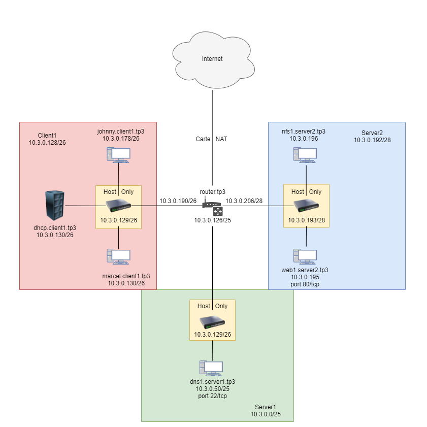

# TP3 : Progressons vers le réseau d'infrastructure

# Sommaire

- [TP3 : Progressons vers le réseau d'infrastructure](#tp3--progressons-vers-le-réseau-dinfrastructure)
- [Sommaire](#sommaire)
- [0. Prérequis](#0-prérequis)
  - [Checklist](#checklist)
- [I. (mini)Architecture réseau](#i-miniarchitecture-réseau)
  - [1. Adressage](#1-adressage)
  - [2. Routeur](#2-routeur)
- [II. Services d'infra](#ii-services-dinfra)
  - [1. Serveur DHCP](#1-serveur-dhcp)
  - [2. Serveur DNS](#2-serveur-dns)
    - [A. Our own DNS server](#a-our-own-dns-server)
    - [B. SETUP copain](#b-setup-copain)
  - [3. Get deeper](#3-get-deeper)
    - [A. DNS forwarder](#a-dns-forwarder)
    - [B. On revient sur la conf du DHCP](#b-on-revient-sur-la-conf-du-dhcp)
- [Entracte](#entracte)
- [III. Services métier](#iii-services-métier)
  - [1. Serveur Web](#1-serveur-web)
  - [2. Partage de fichiers](#2-partage-de-fichiers)
    - [A. L'introduction wola](#a-lintroduction-wola)
    - [B. Le setup wola](#b-le-setup-wola)
- [IV. Un peu de théorie : TCP et UDP](#iv-un-peu-de-théorie--tcp-et-udp)
- [V. El final](#v-el-final)

# I. (mini)Architecture réseau

**Le but ici va être de mettre en place 3 réseaux, dont vous choisirez vous-mêmes les adresses.** Les contraintes :

## 1. Adressage

🌞 tableau des réseaux qui rend compte des adresses choisies :

| Nom du réseau | Adresse du réseau | Masque            | Nombre de clients possibles | Adresse passerelle | Adresse broadcast    |
|---------------|-------------------|-------------------|-----------------------------|-------------------------------------------|
| `client1`     | `10.3.0.129`      | `255.255.255.192` | `62`                        | `10.3.0.190`       |   `10.3.0.191`       |
| `server1`     | `10.3.0.1`        | `255.255.255.128` | `126`                       | `10.3.0.126`       |   `10.3.0.127`       |
| `server2`     | `10.3.0.193`      | `255.255.255.240` | `14`                        | `10.3.0.205`       |   `10.3.0.207`       |

🌞 **Vous remplirez aussi** au fur et à mesure que vous avancez dans le TP, au fur et à mesure que vous créez des machines, **le 🗃️ tableau d'adressage 🗃️ suivant :**

| Nom machine         | Adresse de la machine dans le réseau `client1` | Adresse dans `server1` | Adresse dans `server2` | Adresse de passerelle  |
|---------------------|------------------------------------------------|------------------------|------------------------|------------------------|
| `router.tp3`        | `10.3.0.190/26`                                | `10.3.0.126/25`        | `10.3.0.206/28`        | Carte NAT              |
| `marcel.client1.tp3`| `10.3.0.130/26`                                |                        |                        | `router 10.3.0.190/26` |
| `dhcp.client1.tp3`  | `10.3.0.150/26`                                |                        |                        | `router 10.3.0.190/26` |
| `dns1.server1.tp3`  |                                                | `10.3.0.50/25`         |                        | `router 10.3.0.126/26` |
| `johnny.server1.tp3`| `10.3.0.178/26`                                |                        |                        | `router 10.3.0.190/26` |
| `web1.server2.tp3`  |                                                |                        | `10.3.0.195/28`        | `router 10.3.0.206/28` |
| `nfs1.server2.tp3`  |                                                |                        | `10.3.0.196/28`        | `router 10.3.0.206/28` |

## 2. Routeur 

🖥️ **VM router.tp3**

🌞 **Vous pouvez d'ores-et-déjà créer le routeur. Pour celui-ci, vous me prouverez que :**

- il a bien une IP dans les 3 réseaux, l'IP que vous avez choisie comme IP de passerelle
```
[mathis@router ~]$ ip a
3: enp0s8: <BROADCAST,MULTICAST,UP,LOWER_UP> mtu 1500 qdisc fq_codel state UP group default qlen 1000
    link/ether 08:00:27:0a:50:bb brd ff:ff:ff:ff:ff:ff
    inet 10.3.0.190/26 brd 10.3.0.191 scope global noprefixroute enp0s8
       valid_lft forever preferred_lft forever
4: enp0s9: <BROADCAST,MULTICAST,UP,LOWER_UP> mtu 1500 qdisc fq_codel state UP group default qlen 1000
    link/ether 08:00:27:04:92:22 brd ff:ff:ff:ff:ff:ff
    inet 10.3.0.126/25 brd 10.3.0.127 scope global noprefixroute enp0s9
       valid_lft forever preferred_lft forever
5: enp0s10: <BROADCAST,MULTICAST,UP,LOWER_UP> mtu 1500 qdisc fq_codel state UP group default qlen 1000
    link/ether 08:00:27:82:a8:9c brd ff:ff:ff:ff:ff:ff
    inet 10.3.0.206/28 brd 10.3.0.207 scope global noprefixroute enp0s10
       valid_lft forever preferred_lft forever
    inet6 fe80::a00:27ff:fe82:a89c/64 scope link
       valid_lft forever preferred_lft forever
```
- il a un accès internet
```
[mathis@router ~]$ ping 8.8.8.8 -c 3
PING 8.8.8.8 (8.8.8.8) 56(84) bytes of data.
64 bytes from 8.8.8.8: icmp_seq=1 ttl=114 time=21.9 ms
64 bytes from 8.8.8.8: icmp_seq=2 ttl=114 time=17.9 ms
64 bytes from 8.8.8.8: icmp_seq=3 ttl=114 time=17.8 ms

--- 8.8.8.8 ping statistics ---
3 packets transmitted, 3 received, 0% packet loss, time 2003ms
rtt min/avg/max/mdev = 17.783/19.213/21.912/1.909 ms
```
- il a de la résolution de noms
```
[mathis@router ~]$ ping google.com -c 3
PING google.com (216.58.214.78) 56(84) bytes of data.
64 bytes from fra15s10-in-f78.1e100.net (216.58.214.78): icmp_seq=1 ttl=114 time=34.9 ms
64 bytes from fra15s10-in-f78.1e100.net (216.58.214.78): icmp_seq=2 ttl=114 time=24.6 ms
64 bytes from fra15s10-in-f78.1e100.net (216.58.214.78): icmp_seq=3 ttl=114 time=31.8 ms

--- google.com ping statistics ---
3 packets transmitted, 3 received, 0% packet loss, time 2005ms
rtt min/avg/max/mdev = 24.610/30.418/34.885/4.303 ms
```
- il porte le nom `router.tp3`
```
[mathis@router ~]$ hostname
router.tp3
```
- n'oubliez pas d'activer le routage sur la machine
```
[mathis@router ~]$  sudo firewall-cmd --list-all
public (active)
  masquerade: yes
```
Le routage est déjà activé sur ma machine.

# II. Services d'infra

## 1. Serveur DHCP

🖥️ **VM `dhcp.client1.tp3`** créée.

🌞 **Mettre en place une machine qui fera office de serveur DHCP** dans le réseau `client1`. Elle devra :

- porter le nom `dhcp.client1.tp3`
```
[mathis@dhcp ~]$ sudo hostname
[sudo] password for mathis:
dhcp.client1.tp3
```
- donner une IP aux machines clients qui le demande
```
[mathis@dhcp ~]$ sudo systemctl status dhcpd
● dhcpd.service - DHCPv4 Server Daemon
   Loaded: loaded (/usr/lib/systemd/system/dhcpd.service; enabled; vendor preset: disabled)
   Active: active (running) since Tue 2021-10-05 11:41:22 CEST; 8min ago
     Docs: man:dhcpd(8)
           man:dhcpd.conf(5)
 Main PID: 1457 (dhcpd)
   Status: "Dispatching packets..."
    Tasks: 1 (limit: 4934)
   Memory: 4.9M
   CGroup: /system.slice/dhcpd.service
           └─1457 /usr/sbin/dhcpd -f -cf /etc/dhcp/dhcpd.conf -user dhcpd -group dhcpd --no-pid

Oct 05 11:42:11 dhcp.client1.tp3 dhcpd[1457]: DHCPREQUEST for 10.3.0.130 (10.3.0.150) from 08:00:27:af:99:16 via enp0s8
Oct 05 11:42:11 dhcp.client1.tp3 dhcpd[1457]: DHCPACK on 10.3.0.130 to 08:00:27:af:99:16 via enp0s8
Oct 05 11:42:27 dhcp.client1.tp3 dhcpd[1457]: DHCPREQUEST for 10.3.0.4 from 08:00:27:af:99:16 via enp0s8: wrong network.
Oct 05 11:42:27 dhcp.client1.tp3 dhcpd[1457]: DHCPNAK on 10.3.0.4 to 08:00:27:af:99:16 via enp0s8
Oct 05 11:42:27 dhcp.client1.tp3 dhcpd[1457]: DHCPDISCOVER from 08:00:27:af:99:16 via enp0s8
Oct 05 11:42:27 dhcp.client1.tp3 dhcpd[1457]: DHCPOFFER on 10.3.0.130 to 08:00:27:af:99:16 (client1) via enp0s8
Oct 05 11:42:27 dhcp.client1.tp3 dhcpd[1457]: DHCPREQUEST for 10.3.0.130 (10.3.0.150) from 08:00:27:af:99:16 (client1) >
Oct 05 11:42:27 dhcp.client1.tp3 dhcpd[1457]: DHCPACK on 10.3.0.130 to 08:00:27:af:99:16 (client1) via enp0s8
Oct 05 11:49:22 dhcp.client1.tp3 dhcpd[1457]: DHCPREQUEST for 10.3.0.130 from 08:00:27:af:99:16 (client1) via enp0s8
Oct 05 11:49:22 dhcp.client1.tp3 dhcpd[1457]: DHCPACK on 10.3.0.130 to 08:00:27:af:99:16 via enp0s8
```
- leur donner l'adresse de leur passerelle
- leur donner l'adresse d'un DNS utilisable

📁 **Fichier `dhcpd.conf`**

---

🖥️ **VM marcel.client1.tp3**

🌞 **Mettre en place un client dans le réseau `client1`**

- de son p'tit nom `marcel.client1.tp3`

- la machine récupérera une IP dynamiquement grâce au serveur DHCP
```
[mathis@marcel ~]$ ip a
1: lo: <LOOPBACK,UP,LOWER_UP> mtu 65536 qdisc noqueue state UNKNOWN group default qlen 1000
    link/loopback 00:00:00:00:00:00 brd 00:00:00:00:00:00
    inet 127.0.0.1/8 scope host lo
       valid_lft forever preferred_lft forever
    inet6 ::1/128 scope host
       valid_lft forever preferred_lft forever
2: enp0s8: <BROADCAST,MULTICAST,UP,LOWER_UP> mtu 1500 qdisc fq_codel state UP group default qlen 1000
    link/ether 08:00:27:af:99:16 brd ff:ff:ff:ff:ff:ff
    inet 10.3.0.130/26 brd 10.3.0.191 scope global dynamic noprefixroute enp0s8
       valid_lft 708sec preferred_lft 708sec
    inet6 fe80::a00:27ff:feaf:9916/64 scope link
       valid_lft forever preferred_lft forever
```
- ainsi que sa passerelle et une adresse d'un DNS utilisable
```[mathis@marcel ~]$ cat /etc/resolv.conf
# Generated by NetworkManager
nameserver 1.1.1.1
```

🌞 **Depuis `marcel.client1.tp3`**

- prouver qu'il a un accès internet + résolution de noms, avec des infos récupérées par votre DHCP
```
[mathis@client1 ~]$ ping -c 3 8.8.8.8
PING 8.8.8.8 (8.8.8.8) 56(84) bytes of data.
64 bytes from 8.8.8.8: icmp_seq=1 ttl=114 time=20.1 ms
64 bytes from 8.8.8.8: icmp_seq=2 ttl=114 time=23.4 ms
64 bytes from 8.8.8.8: icmp_seq=3 ttl=114 time=22.2 ms

--- 8.8.8.8 ping statistics ---
3 packets transmitted, 3 received, 0% packet loss, time 2004ms
rtt min/avg/max/mdev = 20.103/21.915/23.407/1.373 ms
```
```
[mathis@client1 ~]$ dig google.com

; <<>> DiG 9.11.26-RedHat-9.11.26-4.el8_4 <<>> google.com
;; global options: +cmd
;; Got answer:
;; ->>HEADER<<- opcode: QUERY, status: NOERROR, id: 29765
;; flags: qr rd ra; QUERY: 1, ANSWER: 1, AUTHORITY: 0, ADDITIONAL: 1

;; OPT PSEUDOSECTION:
; EDNS: version: 0, flags:; udp: 1232
;; QUESTION SECTION:
;google.com.                    IN      A

;; ANSWER SECTION:
google.com.             178     IN      A       216.58.214.174

;; Query time: 21 msec
;; SERVER: 1.1.1.1#53(1.1.1.1)
;; WHEN: Tue Oct 05 11:59:55 CEST 2021
;; MSG SIZE  rcvd: 55
```
```
[mathis@client1 ~]$ ping -c 3 google.com
PING google.com (142.250.179.110) 56(84) bytes of data.
64 bytes from par21s20-in-f14.1e100.net (142.250.179.110): icmp_seq=1 ttl=114 time=20.8 ms
64 bytes from par21s20-in-f14.1e100.net (142.250.179.110): icmp_seq=2 ttl=114 time=19.2 ms
64 bytes from par21s20-in-f14.1e100.net (142.250.179.110): icmp_seq=3 ttl=114 time=21.3 ms

--- google.com ping statistics ---
3 packets transmitted, 3 received, 0% packet loss, time 2003ms
rtt min/avg/max/mdev = 19.172/20.422/21.250/0.906 ms
```

- à l'aide de la commande `traceroute`, prouver que `marcel.client1.tp3` passe par `router.tp3` pour sortir de son réseau

```
[mathis@client1 ~]$ traceroute 8.8.8.8
traceroute to 8.8.8.8 (8.8.8.8), 30 hops max, 60 byte packets
 1  _gateway (10.3.0.190)  4.444 ms  3.942 ms  3.755 ms
 2  10.0.2.2 (10.0.2.2)  3.097 ms  2.909 ms  2.721 ms
```
10.3.0.190 est bien l'ip de notre router.

## 2. Serveur DNS

### A. Our own DNS server

### B. SETUP copain

🖥️ **VM dns1.server1.tp3**

> Nous avons dans ce TP 2 zones à gérer : `server1.tp3`, `server2.tp3`. J'avoue j'suis pas gentil, ça fait beaucoup de fichiers direct. Ca fait manipuler :D

🌞 **Mettre en place une machine qui fera office de serveur DNS**

- dans le réseau `server1`
```
[mathis@dns1 ~]$ ip a
1: lo: <LOOPBACK,UP,LOWER_UP> mtu 65536 qdisc noqueue state UNKNOWN group default qlen 1000
    link/loopback 00:00:00:00:00:00 brd 00:00:00:00:00:00
    inet 127.0.0.1/8 scope host lo
       valid_lft forever preferred_lft forever
    inet6 ::1/128 scope host
       valid_lft forever preferred_lft forever
2: enp0s8: <BROADCAST,MULTICAST,UP,LOWER_UP> mtu 1500 qdisc fq_codel state UP group default qlen 1000
    link/ether 08:00:27:82:50:ac brd ff:ff:ff:ff:ff:ff
    inet 10.3.0.50/8 brd 10.255.255.255 scope global noprefixroute enp0s8
       valid_lft forever preferred_lft forever
    inet6 fe80::a00:27ff:fe82:50ac/64 scope link noprefixroute
       valid_lft forever preferred_lft forever
```
- de son p'tit nom `dns1.server1.tp3`
```
[mathis@dns1 ~]$ hostname
dns1.server1.tp3
```
- il faudra lui ajouter un serveur DNS public connu, afin qu'il soit capable de résoudre des noms publics comme `google.com`
  - conf classique avec le fichier `/etc/resolv.conf` ou les fichiers de conf d'interface
  ```
  [mathis@dns1 ~]$ cat /etc/resolv.conf
  # Generated by NetworkManager
  search home server1.tp3
  nameserver 1.1.1.1
  [mathis@dns1 ~]$ dig google.com

  ; <<>> DiG 9.11.26-RedHat-9.11.26-4.el8_4 <<>> google.com
  ;; global options: +cmd
  ;; Got answer:
  ;; ->>HEADER<<- opcode: QUERY, status: NOERROR, id: 22549
  ;; flags: qr rd ra; QUERY: 1, ANSWER: 1, AUTHORITY: 0, ADDITIONAL: 1

  ;; OPT PSEUDOSECTION:
  ; EDNS: version: 0, flags:; udp: 1232
  ;; QUESTION SECTION:
  ;google.com.                    IN      A

  ;; ANSWER SECTION:
  google.com.             292     IN      A       142.250.178.142

  ;; Query time: 18 msec
  ;; SERVER: 1.1.1.1#53(1.1.1.1)
  ;; WHEN: Sun Oct 17 16:10:05 CEST 2021
  ;; MSG SIZE  rcvd: 55
  ```
  ```
  [mathis@dns1 ~]$ ping -c 3 google.com
  PING google.com (172.217.19.238) 56(84) bytes of data.
  64 bytes from par21s11-in-f14.1e100.net (172.217.19.238): icmp_seq=1 ttl=112 time=31.1 ms
  64 bytes from par21s11-in-f14.1e100.net (172.217.19.238): icmp_seq=2 ttl=112 time=32.9 ms
  64 bytes from par21s11-in-f14.1e100.net (172.217.19.238): icmp_seq=3 ttl=112 time=25.7 ms

  --- google.com ping statistics ---
  3 packets transmitted, 3 received, 0% packet loss, time 2006ms
  rtt min/avg/max/mdev = 25.741/29.913/32.896/3.039 ms
  ```
- comme pour le DHCP, on part sur "rocky linux dns server" on Google pour les détails de l'install du serveur DNS
  - le paquet que vous allez installer devrait s'appeler **`bind` : c'est le nom du serveur DNS le plus utilisé au monde**
  ```
  [mathis@dns1 ~]$ rpm -qa | grep bind
  bind-export-libs-9.11.26-4.el8_4.x86_64
  python3-bind-9.11.26-4.el8_4.noarch
  bind-libs-lite-9.11.26-4.el8_4.x86_64
  bind-libs-9.11.26-4.el8_4.x86_64
  bind-license-9.11.26-4.el8_4.noarch
  bind-utils-9.11.26-4.el8_4.x86_64
  bind-9.11.26-4.el8_4.x86_64
  ```
- il y aura plusieurs fichiers de conf :
  - un fichier de conf principal `named.conf`
  ```
  [mathis@dns1 ~]$ sudo cat /etc/named.conf
  //
  // named.conf
  //
  // Provided by Red Hat bind package to configure the ISC BIND named(8) DNS
  // server as a caching only nameserver (as a localhost DNS resolver only).
  //
  // See /usr/share/doc/bind*/sample/ for example named configuration files.
  //

  options {
          listen-on port 53 { 127.0.0.1; 10.3.0.50; };
          listen-on-v6 port 53 { ::1; };
          directory       "/var/named";
          dump-file       "/var/named/data/cache_dump.db";
          statistics-file "/var/named/data/named_stats.txt";
          memstatistics-file "/var/named/data/named_mem_stats.txt";
          secroots-file   "/var/named/data/named.secroots";
          recursing-file  "/var/named/data/named.recursing";
          allow-query     { localhost; allowed; };

          /*
          - If you are building an AUTHORITATIVE DNS server, do NOT enable recursion.
          - If you are building a RECURSIVE (caching) DNS server, you need to enable
            recursion.
          - If your recursive DNS server has a public IP address, you MUST enable access
            control to limit queries to your legitimate users. Failing to do so will
            cause your server to become part of large scale DNS amplification
            attacks. Implementing BCP38 within your network would greatly
            reduce such attack surface
          */
          recursion yes;

          dnssec-enable yes;
          dnssec-validation yes;

          managed-keys-directory "/var/named/dynamic";

          pid-file "/run/named/named.pid";
          session-keyfile "/run/named/session.key";

          /* https://fedoraproject.org/wiki/Changes/CryptoPolicy */
          include "/etc/crypto-policies/back-ends/bind.config";
  };

  logging {
          channel default_debug {
                  file "data/named.run";
                  severity dynamic;
          };
  };

  acl "allowed" {
          10.3.0.0/24;
  };

  include "/etc/named.rfc1912.zones";
  include "/etc/named.root.key";
  ```
  ```
  [mathis@dns1 ~]$ sudo named-checkconf
  [sudo] password for mathis:
  ```
  la commande ne me sors rien donc pas d'erreur dans le fichier.
  - des fichiers de zone "forward"
    - permet d'indiquer une correspondance nom -> IP
    - un fichier par zone forward 
    ```
    [mathis@dns1 ~]$ sudo cat /var/named/server1.tp3.forward
    $TTL 86400
    @       IN SOA  dns1.server1.tp3. root.server1.tp3. (
                    2021062301   ; serial
                    21600        ; refresh
                    3600         ; retry
                    604800       ; expire
                    86400 )      ; minimum TTL

    ; Define nameservers
    @       IN NS   dns1.server1.tp3.
    ; DNS Server IP Adresses
    dns1    IN A    10.3.0.50
    ```
    ```
    [mathis@dns1 ~]$ sudo cat /var/named/server2.tp3.forward
    $TTL 86400
    @       IN SOA  dns1.server1.tp3. root.server1.tp3. (
                    2021062301   ; serial
                    21600        ; refresh
                    3600         ; retry
                    604800       ; expire
                    86400 )      ; minimum TTL

    ; Define nameservers
    @       IN NS   dns1.server1.tp3.
    ; Clients records
    router  IN A    10.3.0.190
    ```
    ```
    [mathis@dns1 ~]$ sudo systemctl enable named
    [mathis@dns1 ~]$ sudo systemctl start named
    [mathis@dns1 ~]$ sudo firewall-cmd --add-service=dns
    [mathis@dns1 ~]$ sudo firewall-cmd --add-service=dns --permanent
    [mathis@dns1 ~]$ sudo firewall-cmd --reload
    [mathis@dns1 ~]$ systemctl status named
    ● named.service - Berkeley Internet Name Domain (DNS)
      Loaded: loaded (/usr/lib/systemd/system/named.service; enabled; vendor preset: disabled)
      Active: active (running) since Sun 2021-10-17 19:40:02 CEST; 42min ago
      Process: 1715 ExecStop=/bin/sh -c /usr/sbin/rndc stop > /dev/null 2>&1 || /bin/kill -TERM $MAINPID >
      Process: 1738 ExecStart=/usr/sbin/named -u named -c ${NAMEDCONF} $OPTIONS (code=exited, status=0/SU>
      Process: 1735 ExecStartPre=/bin/bash -c if [ ! "$DISABLE_ZONE_CHECKING" == "yes" ]; then /usr/sbin/>
    Main PID: 1740 (named)
        Tasks: 4 (limit: 11397)
      Memory: 55.1M
      CGroup: /system.slice/named.service
              └─1740 /usr/sbin/named -u named -c /etc/named.conf

    Oct 17 20:17:28 dns1.server1.tp3 named[1740]: network unreachable resolving 'cloudflare.com/A/IN': 24>
    Oct 17 20:17:28 dns1.server1.tp3 named[1740]: network unreachable resolving 'cloudflare.com/A/IN': 24>
    Oct 17 20:17:28 dns1.server1.tp3 named[1740]: network unreachable resolving 'cloudflare.com/A/IN': 24>
    Oct 17 20:17:28 dns1.server1.tp3 named[1740]: network unreachable resolving 'cloudflare.com/A/IN': 24>
    Oct 17 20:17:28 dns1.server1.tp3 named[1740]: network unreachable resolving 'cloudflare.com/A/IN': 24>
    Oct 17 20:17:28 dns1.server1.tp3 named[1740]: network unreachable resolving 'cloudflare.com/A/IN': 24>
    Oct 17 20:17:28 dns1.server1.tp3 named[1740]: network unreachable resolving 'cloudflare.com/A/IN': 24>
    Oct 17 20:17:28 dns1.server1.tp3 named[1740]: network unreachable resolving 'cloudflare.com/A/IN': 24>
    Oct 17 20:17:28 dns1.server1.tp3 named[1740]: network unreachable resolving 'cloudflare.com/DNSKEY/IN>
    Oct 17 20:17:28 dns1.server1.tp3 named[1740]: network unreachable resolving 'cloudflare.com/DNSKEY/IN>
    ```
    
  - **vous ne mettrez pas en place de zones reverse, uniquement les forward**
  - on ne met **PAS** les clients dans les fichiers de zone car leurs adresses IP peuvent changer (ils les récupèrent à l'aide du DHCP)
    - donc votre DNS gérera deux zones : `server1.tp3` et `server2.tp3`
    - les réseaux où les IPs sont définies de façon statique !
    ```
    [mathis@dns1 ~]$ sudo cat /etc/named.rfc1912.zones

    [...]

    zone "server1.tp3" IN {
            type master;
            file "/var/named/server1.tp3.forward";
            allow-update { none; };
    };

    zone "server2.tp3" IN {
            type master;
            file "/var/named/server2.tp3.forward";
            allow-update { none; };
    };
    ```

> Vous avez donc 3 fichiers à gérer : le fichier de conf principal `named.conf`. Un fichier de zone forward pour la zone `server1.tp3` : `server1.tp3.forward`. Et un  fichier similaire pour la zone `server2.tp3`.

> 💡 Je vous recommande de d'abord mettre en place une simple zone *Forward* et de tester. Et après, d'ajouter la deuxième zone. Procédez de façon itérative, pour comprendre d'où viennent vos erreurs quand elles surviennent.

🌞 **Tester le DNS depuis `marcel.client1.tp3`** 

- définissez **manuellement** l'utilisation de votre serveur DNS
dans la VM dhcp, on modifie le fichier conf dhcpd.conf:
  ```
  default-lease-time 900;
  max-lease-time 10800;
  authoritative;
  subnet 10.3.0.128 netmask 255.255.255.192 {
      range 10.3.0.129 10.3.0.190;
      option routers 10.3.0.190;
      option domain-name-servers 10.3.0.50;
  }

  ```
- essayez une résolution de nom avec `dig`
  - une résolution de nom classique
    - `dig <NOM>` pour obtenir l'IP associée à un nom
    - on teste la zone forward
      ```
      [mathis@marcel ~]$ dig google.com

      ; <<>> DiG 9.11.26-RedHat-9.11.26-4.el8_4 <<>> google.com
      ;; global options: +cmd
      ;; Got answer:
      ;; ->>HEADER<<- opcode: QUERY, status: NOERROR, id: 11950
      ;; flags: qr rd ra; QUERY: 1, ANSWER: 1, AUTHORITY: 4, ADDITIONAL: 9

      ;; OPT PSEUDOSECTION:
      ; EDNS: version: 0, flags:; udp: 1232
      ; COOKIE: bcf5da42260ba081f5a63434616c64655d053a4004542378 (good)
      ;; QUESTION SECTION:
      ;google.com.                    IN      A

      ;; ANSWER SECTION:
      google.com.             300     IN      A       216.58.213.174

      ;; AUTHORITY SECTION:
      google.com.             172800  IN      NS      ns4.google.com.
      google.com.             172800  IN      NS      ns1.google.com.
      google.com.             172800  IN      NS      ns3.google.com.
      google.com.             172800  IN      NS      ns2.google.com.

      ;; ADDITIONAL SECTION:
      ns2.google.com.         172800  IN      A       216.239.34.10
      ns1.google.com.         172800  IN      A       216.239.32.10
      ns3.google.com.         172800  IN      A       216.239.36.10
      ns4.google.com.         172800  IN      A       216.239.38.10
      ns2.google.com.         172800  IN      AAAA    2001:4860:4802:34::a
      ns1.google.com.         172800  IN      AAAA    2001:4860:4802:32::a
      ns3.google.com.         172800  IN      AAAA    2001:4860:4802:36::a
      ns4.google.com.         172800  IN      AAAA    2001:4860:4802:38::a

      ;; Query time: 503 msec
      ;; SERVER: 10.3.0.50#53(10.3.0.50)
      ;; WHEN: Sun Oct 17 19:59:02 CEST 2021
      ;; MSG SIZE  rcvd: 331
      ```
- prouvez que c'est bien votre serveur DNS qui répond pour chaque `dig`
  Notre serveur DNS est bien utilisé pour le dig de google.com, l'info se trouve en bas de l'output du dig google.com:
  ```
  [mathis@marcel ~]$ dig google.com
  [...]
  ;; SERVER: 10.3.0.50#53(10.3.0.50)
  [...]
  ```
> Pour rappel, avec `dig`on peut préciser directement sur la ligne de commande à quel serveur poser la question avec  le caractère `@`. Par exemple `dig google.com @8.8.8.8` permet de préciser explicitement qu'on veut demander à `8.8.8.8` à quelle IP se trouve `google.com`.

⚠️ **NOTE : A partir de maintenant, vous devrez modifier les fichiers de zone pour chaque nouvelle machine ajoutée (voir [📝**checklist**📝](#checklist).**

🌞 Configurez l'utilisation du serveur DNS sur TOUS vos noeuds

- les serveurs, on le fait à la main
- les clients, c'est fait *via* DHCP

⚠️**A partir de maintenant, vous n'utiliserez plus DU TOUT les IPs pour communiquer entre vos machines, mais uniquement leurs noms.**

## 3. Get deeper

On va affiner un peu la configuration des outils mis en place.

### A. DNS forwarder

🌞 **Affiner la configuration du DNS**

- faites en sorte que votre DNS soit désormais aussi un forwarder DNS
- c'est à dire que s'il ne connaît pas un nom, il ira poser la question à quelqu'un d'autre
```
[mathis@dns1 ~]$ sudo cat /etc/named.conf | grep recursion
[sudo] password for mathis:
         - If you are building an AUTHORITATIVE DNS server, do NOT enable recursion.
           recursion.
        recursion yes;
```

> Hint : c'est la clause `recursion` dans le fichier `/etc/named.conf`. Et c'est déjà activé par défaut en fait.

🌞 Test !

- vérifier depuis `marcel.client1.tp3` que vous pouvez résoudre des noms publics comme `google.com` en utilisant votre propre serveur DNS (commande `dig`)
- pour que ça fonctionne, il faut que `dns1.server1.tp3` soit lui-même capable de résoudre des noms, avec `1.1.1.1` par exemple
  ```
  [mathis@marcel ~]$ dig google.com

  ; <<>> DiG 9.11.26-RedHat-9.11.26-4.el8_4 <<>> google.com
  ;; global options: +cmd
  ;; Got answer:
  ;; ->>HEADER<<- opcode: QUERY, status: NOERROR, id: 34932
  ;; flags: qr rd ra; QUERY: 1, ANSWER: 1, AUTHORITY: 4, ADDITIONAL: 9

  ;; OPT PSEUDOSECTION:
  ; EDNS: version: 0, flags:; udp: 1232
  ; COOKIE: b639a14f493c4779c02bae3b616c6d144efe6ef4838c017c (good)
  ;; QUESTION SECTION:
  ;google.com.                    IN      A

  ;; ANSWER SECTION:
  google.com.             300     IN      A       216.58.213.174

  ;; AUTHORITY SECTION:
  google.com.             170577  IN      NS      ns2.google.com.
  google.com.             170577  IN      NS      ns3.google.com.
  google.com.             170577  IN      NS      ns4.google.com.
  google.com.             170577  IN      NS      ns1.google.com.

  ;; ADDITIONAL SECTION:
  ns2.google.com.         170577  IN      A       216.239.34.10
  ns1.google.com.         170577  IN      A       216.239.32.10
  ns3.google.com.         170577  IN      A       216.239.36.10
  ns4.google.com.         170577  IN      A       216.239.38.10
  ns2.google.com.         170577  IN      AAAA    2001:4860:4802:34::a
  ns1.google.com.         170577  IN      AAAA    2001:4860:4802:32::a
  ns3.google.com.         170577  IN      AAAA    2001:4860:4802:36::a
  ns4.google.com.         170577  IN      AAAA    2001:4860:4802:38::a

  ;; Query time: 116 msec
  ;; SERVER: 10.3.0.50#53(10.3.0.50)
  ;; WHEN: Sun Oct 17 20:36:05 CEST 2021
  ;; MSG SIZE  rcvd: 331
  ```

### B. On revient sur la conf du DHCP

🖥️ **VM johnny.client1.tp3**

🌞 **Affiner la configuration du DHCP**

- faites en sorte que votre DHCP donne désormais l'adresse de votre serveur DNS aux clients
- créer un nouveau client `johnny.client1.tp3` qui récupère son IP, et toutes les nouvelles infos, en DHCP

  ```
  [mathis@johnny ~]$ sudo dhclient
  [mathis@johnny ~]$ ip a
  [...]
  3: enp0s8: <BROADCAST,MULTICAST,UP,LOWER_UP> mtu 1500 qdisc fq_codel state UP group default qlen 1000
      link/ether 08:00:27:db:a9:e4 brd ff:ff:ff:ff:ff:ff
      inet 10.3.0.183/26 brd 10.3.0.191 scope global dynamic noprefixroute enp0s8
        valid_lft 379sec preferred_lft 379sec
      inet 10.3.0.178/26 brd 10.3.0.191 scope global secondary dynamic enp0s8
        valid_lft 945sec preferred_lft 945sec
      inet6 fe80::a00:27ff:fedb:a9e4/64 scope link noprefixroute
        valid_lft forever preferred_lft forever
  [mathis@johnny ~]$ cat /etc/resolv.conf
  ; generated by /usr/sbin/dhclient-script
  nameserver 10.3.0.50
  ```

---

# III. Services métier

## 1. Serveur Web

🖥️ **VM web1.server2.tp3**

🌞 **Setup d'une nouvelle machine, qui sera un serveur Web, une belle appli pour nos clients**

- vous utiliserez le serveur web que vous voudrez, le but c'est d'avoir un serveur web fast, pas d'y passer 1000 ans :)

Pour cette partie, j'ai installé un server Apache.
  - **dans tous les cas, n'oubliez pas d'ouvrir le port associé dans le firewall** pour que le serveur web soit joignable

    mon port est déjà ouvert et mon firewall a été redémarré au préalable.
    ```
    [mathis@web1 ~]$ sudo firewall-cmd --list-all | grep ports
    ports: 22/tcp 80/tcp
    ```

> Une bête page HTML fera l'affaire. On est pas là pour faire du design. Et vous prenez pas la tête pour l'install, appelez-moi vite s'il faut, on est pas en système ni en Linux non plus. On est en réseau, on veut juste un serveur web derrière un port :)

🌞 **Test test test et re-test**

- testez que votre serveur web est accessible depuis `marcel.client1.tp3`
  ```
  [mathis@marcel ~]$ cat /etc/hosts
  [...]
  10.3.0.195  web1 web1.server2.tp3
  ```
  - utilisez la commande `curl` pour effectuer des requêtes HTTP
    ```
    [mathis@marcel ~]$ curl web1
    <!doctype html>
    <html>
      <head>
        <meta charset='utf-8'>
        <meta name='viewport' content='width=device-width, initial-scale=1'>
        <title>HTTP Server Test Page powered by: Rocky Linux</title>
        <style type="text/css">
          /*<![CDATA[*/

          html {
            height: 100%;
            width: 100%;
          }

    [...]

    ```
---

## 2. Partage de fichiers

### A. L'introduction wola

[...]

### B. Le setup wola

🖥️ **VM nfs1.server2.tp3**

🌞 **Setup d'une nouvelle machine, qui sera un serveur NFS**

- réseau `server2`
  ```
  [mathis@nfs1 ~]$ sudo cat /etc/sysconfig/network-scripts/ifcfg-enp0s8
  [sudo] password for mathis:
  BOOTPROTO=static
  NAME=enp0s8
  DEVICE=enp0s8
  ONBOOT=yes
  IPADDR=10.3.0.196
  NETMASK=255.255.255.240
  DNS1=1.1.1.1
  ```
- son nooooom : `nfs1.server2.tp3` !
  ```
  [mathis@nfs1 ~]$ hostname
  nfs1.server2.tp3
  ```
- je crois que vous commencez à connaître la chanson... Google "nfs server rocky linux"
  - [ce lien me semble être particulièrement simple et concis](https://www.server-world.info/en/note?os=Rocky_Linux_8&p=nfs&f=1)
    ```
    [mathis@nfs1 ~]$ sudo dnf install -y nfs-utils
    Installed:
    gssproxy-0.8.0-19.el8.x86_64                      keyutils-1.5.10-6.el8.x86_64
    libevent-2.1.8-5.el8.x86_64                       libverto-libevent-0.3.0-5.el8.x86_64
    nfs-utils-1:2.3.3-41.el8_4.2.x86_64               rpcbind-1.2.5-8.el8.x86_64
    Complete!

    [mathis@nfs1 ~]$ sudo vim /etc/idmapd.conf
    [mathis@nfs1 ~]$ sudo cat /etc/idmapd.conf | grep Domain
    Domain = server2.tp3

    [mathis@nfs1 ~]$ sudo mkdir /srv/nfs_share/
    [mathis@nfs1 ~]$ sudo nano /etc/exports
    [mathis@nfs1 ~]$ cat /etc/exports
    /srv/nfs_share 10.3.0.195/28(rw,no_root_squash)
    [mathis@nfs1 ~]$ sudo systemctl enable --now rpcbind nfs-server
    Created symlink /etc/systemd/system/multi-user.target.wants/nfs-server.service → /usr/lib/systemd/system/nfs-server.service.
    [mathis@nfs1 ~]$ sudo firewall-cmd --add-service=nfs
    success
    [mathis@nfs1 ~]$ sudo firewall-cmd --add-service={nfs3,mountd,rpc-bind}
    success
    [mathis@nfs1 ~]$ sudo firewall-cmd --runtime-to-permanent
    success
    ```

- **vous partagerez un dossier créé à cet effet : `/srv/nfs_share/`**

🌞 **Configuration du client NFS**

- effectuez de la configuration sur `web1.server2.tp3` pour qu'il accède au partage NFS
  ```
  [mathis@web1 ~]$ sudo dnf install -y nfs-utils
  [sudo] password for mathis:
  Installed:
  gssproxy-0.8.0-19.el8.x86_64                      keyutils-1.5.10-6.el8.x86_64
  libevent-2.1.8-5.el8.x86_64                       libverto-libevent-0.3.0-5.el8.x86_64
  nfs-utils-1:2.3.3-41.el8_4.2.x86_64               rpcbind-1.2.5-8.el8.x86_64

  Complete!

  [mathis@web1 ~]$ sudo nano /etc/idmapd.conf
  [mathis@web1 ~]$ sudo cat /etc/idmapd.conf | grep Domain
  Domain = server2.tp3
  ```
- le partage NFS devra être monté dans `/srv/nfs/`
  ```
  [mathis@web1 srv]$ sudo mount -t nfs nfs1.server2.tp3:/srv/nfs_share /srv/nfs
  mount.nfs: access denied by server while mounting nfs1.server2.tp3:/srv/nfs_share
  ```

🌞 **TEEEEST**

- tester que vous pouvez lire et écrire dans le dossier `/srv/nfs` depuis `web1.server2.tp3`
- vous devriez voir les modifications du côté de  `nfs1.server2.tp3` dans le dossier `/srv/nfs_share/`

# IV. Un peu de théorie : TCP et UDP

Bon bah avec tous ces services, on a de la matière pour bosser sur TCP et UDP. P'tite partie technique pure avant de conclure.

🌞 **Déterminer, pour chacun de ces protocoles, s'ils sont encapsulés dans du TCP ou de l'UDP :**

- SSH est en TCP sur le port 22
- HTTP est en tcp sur le port 80 mais je n'arrive pas a capturer de trame avec tcpdump.
  J'ai effectué la commande suivante:
  ```
  [mathis@web1 ~]$ sudo tcpdump -w tp3_http.pcap not port 22
  ```
  et j'ai effectué un  curl depuis plusieures VMs et des requêtes depuis mon navigateur mais aucune trame n'est capturée 
- DNS est en UDP
  ```
  [mathis@dns1 ~]$ sudo tcpdump -w tp3_dns.pcap
  dropped privs to tcpdump
  tcpdump: listening on enp0s3, link-type EN10MB (Ethernet), capture size 262144 bytes
  2 packets captured
  2 packets received by filter
  0 packets dropped by kernel
  ```
- NFS est en TCP

> N'ayant pas pu configurer le partage NFS je ne suis malheuresement pas en mesure de faire une capture tcpdump
Cependant après quelques recherches, j'ai trouvé que NFS est encapsulé en TCP.
Pour trouver ce résultat, il aurait fallu que je lance tcpdump sur la machine nfs1.server2.tp3 et que je crée un fichier dans le dossier de partage NFS.


📁 **Captures réseau : **
 [**tp3_ssh.pcap**](/pcap _files/tp3_ssh.pcap)
 `tp3_http.pcap`
 `tp3_dns.pcap`
 `tp3_nfs.pcap`

> **Prenez le temps** de réfléchir à pourquoi on a utilisé TCP ou UDP pour transmettre tel ou tel protocole. Réfléchissez à quoi servent chacun de ces protocoles, et de ce qu'on a besoin qu'ils réalisent.

🌞 **Capturez et mettez en évidence un *3-way handshake***

📁 **Capture réseau `tp3_3way.pcap`**

# V. El final

🌞 **Bah j'veux un schéma.**

- réalisé avec drawio



- dans le rendu, mettez moi ici à la fin :
  - le 🗃️ tableau des réseaux 🗃️

    | Nom du réseau | Adresse du réseau | Masque            | Nombre de clients possibles | Adresse passerelle | Adresse broadcast    |
    |---------------|-------------------|-------------------|-----------------------------|-------------------------------------------|
    | `client1`     | `10.3.0.129`      | `255.255.255.192` | `62`                        | `10.3.0.190`       |   `10.3.0.191`       |
    | `server1`     | `10.3.0.1`        | `255.255.255.128` | `126`                       | `10.3.0.126`       |   `10.3.0.127`       |
    | `server2`     | `10.3.0.193`      | `255.255.255.240` | `14`                        | `10.3.0.205`       |   `10.3.0.207`       |

  - le 🗃️ tableau d'adressage 🗃️

    | Nom machine         | Adresse de la machine dans le réseau `client1` | Adresse dans `server1` | Adresse dans `server2` | Adresse de passerelle  |
    |---------------------|------------------------------------------------|------------------------|------------------------|------------------------|
    | `router.tp3`        | `10.3.0.190/26`                                | `10.3.0.126/25`        | `10.3.0.206/28`        | Carte NAT              |
    | `marcel.client1.tp3`| `10.3.0.130/26`                                |                        |                        | `router 10.3.0.190/26` |
    | `dhcp.client1.tp3`  | `10.3.0.150/26`                                |                        |                        | `router 10.3.0.190/26` |
    | `dns1.server1.tp3`  |                                                | `10.3.0.50/25`         |                        | `router 10.3.0.126/26` |
    | `johnny.server1.tp3`| `10.3.0.178/26`                                |                        |                        | `router 10.3.0.190/26` |
    | `web1.server2.tp3`  |                                                |                        | `10.3.0.195/28`        | `router 10.3.0.206/28` |
    | `nfs1.server2.tp3`  |                                                |                        | `10.3.0.196/28`        | `router 10.3.0.206/28` |

    - on appelle ça aussi un "plan d'adressage IP" :)

🌞 **Et j'veux des fichiers aussi, tous les fichiers de conf du DNS**

- 📁 Fichiers de zone
- 📁 Fichier de conf principal DNS `named.conf`
- faites ça à peu près propre dans le rendu, que j'ai plus qu'à cliquer pour arriver sur le fichier ce serait top