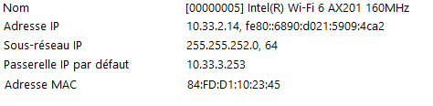

# I. Exploration locale en solo

## 1. Affichage d'informations sur la pile TCP/IP locale

### En ligne de commande:

Afficher les infos des cartes réseau: 
```
PS C:\Users\Mathis> ipconfig /all 
```

infos cartes réseau:
```
interface WIfi :
   Description. . . . . . . . . . . . . . : Intel(R) Wi-Fi 6 AX201 160MHz
   Adresse physique . . . . . . . . . . . : 84-FD-D1-10-23-45
   Adresse IPv4. . . . . . . . . . . . . .: 10.33.2.14(préféré)
   
interface Ethernet : 
   Statut du média. . . . . . . . . . . . : Média déconnecté
   Description. . . . . . . . . . . . . . : Realtek USB GbE Family Controller
   Adresse physique . . . . . . . . . . . : 00-E0-4C-68-34-A6
```
Gateway:
```
   Description. . . . . . . . . . . . . . : Intel(R) Wi-Fi 6 AX201 160MHz
   Passerelle par défaut. . . . . . . . . : 10.33.3.253
```

### En graphique (GUI : Graphical User Interface)
```
Aller dans :
 Paramètres -> Réseau et Internet -> Wi-Fi (ou Ethernet en fonction de votre connectique) -> click sur le nom du réseau
Les informations se trouvent en bas de la page.

Autre possibilité : aller dans Informations système -> Composants -> réseau -> Carte
```

#### résultat:


(capture d'écran raccourcie pour le TP)
```
Dans Ynov, la gateway sert comme un pont pour communiquer avec des réseaux extérieurs à Ynov.
```
## 2. Modifications des informations

### A. Modification d'adresse IP (part 1)

Pour accéder aux paramètres de modification de son adresse IP, suivre les étapes suivantes:
```
Paramètres -> Réseau et Internet -> Wi-Fi (ou Ethernet en fonction de votre connectique) -> click sur le nom du réseau -> vers le bas, clicker sur modifier puis passer en manuel.
```


Vérification de la bonne modification de mon adresse IPv4 dans le terminal avec ipconfig:
```
Carte réseau sans fil Wi-Fi :

   Suffixe DNS propre à la connexion. . . :
   Adresse IPv6 de liaison locale. . . . .: fe80::6890:d021:5909:4ca2%19
   Adresse IPv4. . . . . . . . . . . . . .: 10.33.2.176
   Masque de sous-réseau. . . . . . . . . : 255.255.255.0
   Passerelle par défaut. . . . . . . . . : 10.33.2.253
```

Quelques secondes après la modification de l'IP, j'ai subi une perte de connexion car il est possible qu'une autre machine sur le réseau ait déjà cette IP d'attribuée.

### B. Table ARP

afficher la table ARP avec la commande arp /a

```
  Adresse Internet      Adresse physique      Type
  10.33.3.253           00-12-00-40-4c-bf     dynamique
```
Ici, l'adresse mac de la passerelle résseau : 00-12-00-40-4c-bf
L'adresse MAC de la passerelle réseau a été repérée grâce à l'adresse IP de l'interface réseau et de la passerelle.

Ping vers d'autres machines du réseau
```
PS C:\Users\Mathis> ping 10.33.3.17

Envoi d’une requête 'Ping'  10.33.3.17 avec 32 octets de données :
Réponse de 10.33.3.17 : octets=32 temps=202 ms TTL=128
Réponse de 10.33.3.17 : octets=32 temps=6 ms TTL=128
Réponse de 10.33.3.17 : octets=32 temps=32 ms TTL=128
Réponse de 10.33.3.17 : octets=32 temps=4 ms TTL=128
```

```
PS C:\Users\Mathis> ping 10.33.3.219

Envoi d’une requête 'Ping'  10.33.3.219 avec 32 octets de données :
Réponse de 10.33.3.219 : octets=32 temps=10 ms TTL=64
Réponse de 10.33.3.219 : octets=32 temps=208 ms TTL=64
Réponse de 10.33.3.219 : octets=32 temps=213 ms TTL=64
Réponse de 10.33.3.219 : octets=32 temps=170 ms TTL=64

Statistiques Ping pour 10.33.3.219:
    Paquets : envoyés = 4, reçus = 4, perdus = 0 (perte 0%),
Durée approximative des boucles en millisecondes :
    Minimum = 10ms, Maximum = 213ms, Moyenne = 150ms
```
```
PS C:\Users\Mathis> ping 10.33.2.222

Envoi d’une requête 'Ping'  10.33.2.222 avec 32 octets de données :
Réponse de 10.33.2.222 : octets=32 temps=9 ms TTL=64
Réponse de 10.33.2.222 : octets=32 temps=294 ms TTL=64
Réponse de 10.33.2.222 : octets=32 temps=97 ms TTL=64
Réponse de 10.33.2.222 : octets=32 temps=102 ms TTL=64

Statistiques Ping pour 10.33.2.222:
    Paquets : envoyés = 4, reçus = 4, perdus = 0 (perte 0%),
Durée approximative des boucles en millisecondes :
    Minimum = 9ms, Maximum = 294ms, Moyenne = 125ms
```
```
PS C:\Users\Mathis> ping 10.33.3.232

Envoi d’une requête 'Ping'  10.33.3.232 avec 32 octets de données :
Réponse de 10.33.3.232 : octets=32 temps=11 ms TTL=64
Réponse de 10.33.3.232 : octets=32 temps=55 ms TTL=64
Réponse de 10.33.3.232 : octets=32 temps=5 ms TTL=64
Réponse de 10.33.3.232 : octets=32 temps=6 ms TTL=64

Statistiques Ping pour 10.33.3.232:
    Paquets : envoyés = 4, reçus = 4, perdus = 0 (perte 0%),
Durée approximative des boucles en millisecondes :
    Minimum = 5ms, Maximum = 55ms, Moyenne = 19ms
```
```
    IP                        MAC              Type
 10.33.3.17            80-32-53-e2-78-04     dynamique
 10.33.2.222           88-bf-e4-cb-d9-46     dynamique
 10.33.3.219           a0-78-17-b5-63-bb     dynamique
 10.33.3.232           88-66-5a-4d-a7-f5     dynamique
```

### C. nmap

Ping scan sur le réseau Ynov avec la commande ```nmap -sP 10.33.0.0/22```

table ARP : 
```
Interface : 10.33.2.14 --- 0x13
  Adresse Internet      Adresse physique      Type
  10.33.0.85            9e-08-36-e0-c5-22     dynamique
  10.33.0.143           f0-18-98-41-11-07     dynamique
  10.33.0.157           26-57-f1-a3-f2-89     dynamique
  10.33.0.166           7e-7a-66-16-64-ef     dynamique
  10.33.1.93            b8-9a-2a-3d-c1-1a     dynamique
  10.33.2.11            80-32-53-7e-ae-64     dynamique
  10.33.2.22            f8-5e-a0-52-4f-36     dynamique
  10.33.2.42            16-d8-79-91-57-a4     dynamique
  10.33.2.105           ec-2e-98-ca-da-e9     dynamique
  10.33.2.193           e0-2b-e9-7d-a6-c2     dynamique
  10.33.2.230           98-46-0a-96-d5-22     dynamique
  10.33.2.237           be-fd-16-82-f4-05     dynamique
  10.33.3.59            02-47-cd-3d-d4-e9     dynamique
  10.33.3.77            a0-78-17-6b-62-61     dynamique
  10.33.3.203           70-66-55-cf-4b-3b     dynamique
  10.33.3.253           00-12-00-40-4c-bf     dynamique
  10.33.3.255           ff-ff-ff-ff-ff-ff     statique
  224.0.0.22            01-00-5e-00-00-16     statique
  224.0.0.251           01-00-5e-00-00-fb     statique
  224.0.0.252           01-00-5e-00-00-fc     statique
  239.255.255.250       01-00-5e-7f-ff-fa     statique
  255.255.255.255       ff-ff-ff-ff-ff-ff     statique
  ``` 

### D. Modification d'adresse IP (part 2)

Commande nmap: ```nmap -sP 10.33.0.0/22```
Résultat : 
```
MAC Address: 78:31:C1:CF:CB:26 (Apple)
Nmap scan report for 10.33.3.210
Host is up (0.011s latency).
MAC Address: D8:3B:BF:1A:7A:5C (Intel Corporate)
Nmap scan report for 10.33.3.219
```
Je peux donc utiliser les IP de 10.33.3.211 à 10.33.3.218 compris, dans mon cas, je vais prendre la 10.33.3.215


```
PS C:\WINDOWS\system32> ping 8.8.8.8

Envoi d’une requête 'Ping'  8.8.8.8 avec 32 octets de données :
Réponse de 8.8.8.8 : octets=32 temps=18 ms TTL=115
Réponse de 8.8.8.8 : octets=32 temps=19 ms TTL=115
Réponse de 8.8.8.8 : octets=32 temps=19 ms TTL=115
Réponse de 8.8.8.8 : octets=32 temps=19 ms TTL=115

Statistiques Ping pour 8.8.8.8:
    Paquets : envoyés = 4, reçus = 4, perdus = 0 (perte 0%),
Durée approximative des boucles en millisecondes :
    Minimum = 18ms, Maximum = 19ms, Moyenne = 18ms
```

# II. Exploration locale en duo (avec Enzo Peyrataud)

## 3. Modification d'adresse IP


ipconfig :
```
Carte Ethernet Ethernet 4 :

   Suffixe DNS propre à la connexion. . . :
   Adresse IPv6 de liaison locale. . . . .: fe80::20e3:4113:bd3c:92c2%16
   Adresse IPv4. . . . . . . . . . . . . .: 192.168.1.1
   Masque de sous-réseau. . . . . . . . . : 255.255.255.252
   Passerelle par défaut. . . . . . . . . : 192.168.1.2
```
```
PS C:\WINDOWS\system32> ping 192.168.1.2

Envoi d’une requête 'Ping'  192.168.1.2 avec 32 octets de données :
Réponse de 192.168.1.2 : octets=32 temps=1 ms TTL=128
Réponse de 192.168.1.2 : octets=32 temps=1 ms TTL=128
Réponse de 192.168.1.2 : octets=32 temps=1 ms TTL=128
Réponse de 192.168.1.2 : octets=32 temps=1 ms TTL=128

Statistiques Ping pour 192.168.1.2:
    Paquets : envoyés = 4, reçus = 4, perdus = 0 (perte 0%),
Durée approximative des boucles en millisecondes :
    Minimum = 1ms, Maximum = 1ms, Moyenne = 1ms
```
```
PS C:\WINDOWS\system32> arp /a

Interface : 192.168.1.1 --- 0x10
  Adresse Internet      Adresse physique      Type
  192.168.1.2           04-0e-3c-a3-d6-dd     dynamique
  192.168.1.3           ff-ff-ff-ff-ff-ff     statique
  224.0.0.22            01-00-5e-00-00-16     statique
  224.0.0.251           01-00-5e-00-00-fb     statique
  224.0.0.252           01-00-5e-00-00-fc     statique
  239.255.255.250       01-00-5e-7f-ff-fa     statique
  255.255.255.255       ff-ff-ff-ff-ff-ff     statique
```

## 4. Utilisation d'un des deux comme gateway
```
Poste sans Wi-fi : Enzo
IP Enzo : 192.168.1.2
Mon IP : 192.168.1.1
```

ping de ma machine vers celle de Enzo : 
```
PS C:\Users\Mathis> ping 192.168.1.2

Envoi d’une requête 'Ping'  192.168.1.2 avec 32 octets de données :
Réponse de 192.168.1.2 : octets=32 temps<1ms TTL=128
Réponse de 192.168.1.2 : octets=32 temps<1ms TTL=128
Réponse de 192.168.1.2 : octets=32 temps=1 ms TTL=128
Réponse de 192.168.1.2 : octets=32 temps=1 ms TTL=128

Statistiques Ping pour 192.168.1.2:
    Paquets : envoyés = 4, reçus = 4, perdus = 0 (perte 0%),
Durée approximative des boucles en millisecondes :
    Minimum = 0ms, Maximum = 1ms, Moyenne = 0ms
```
ping de la machine de Enzo vers la mienne:
```
PS C:\Users\lucas> ping 192.168.1.1

Envoi d’une requête 'Ping'  192.168.1.1 avec 32 octets de données :
Réponse de 192.168.1.1 : octets=32 temps=2 ms TTL=128
Réponse de 192.168.1.1 : octets=32 temps=5 ms TTL=128
Réponse de 192.168.1.1 : octets=32 temps=3 ms TTL=128
Réponse de 192.168.1.1 : octets=32 temps=2 ms TTL=128

Statistiques Ping pour 192.168.1.1:
    Paquets : envoyés = 4, reçus = 4, perdus = 0 (perte 0%),
Durée approximative des boucles en millisecondes :
    Minimum = 2ms, Maximum = 5ms, Moyenne = 3ms
```

Suite à l'activation du partage réseau depuis les paramètres de partage: 
Ping de ma machine vers 1.1.1.1 : 
```
PS C:\Users\Mathis> ping 1.1.1.1

Envoi d’une requête 'Ping'  1.1.1.1 avec 32 octets de données :
Réponse de 1.1.1.1 : octets=32 temps=18 ms TTL=58
Réponse de 1.1.1.1 : octets=32 temps=17 ms TTL=58
Réponse de 1.1.1.1 : octets=32 temps=18 ms TTL=58
Réponse de 1.1.1.1 : octets=32 temps=22 ms TTL=58

Statistiques Ping pour 1.1.1.1:
    Paquets : envoyés = 4, reçus = 4, perdus = 0 (perte 0%),
Durée approximative des boucles en millisecondes :
    Minimum = 17ms, Maximum = 22ms, Moyenne = 18ms
```

Ping de la machine de Enzo vers 1.1.1.1: 
```
PS C:\Users\lucas> ping 1.1.1.1

Envoi d’une requête 'Ping'  1.1.1.1 avec 32 octets de données :
Réponse de 1.1.1.1 : octets=32 temps=21 ms TTL=57
Réponse de 1.1.1.1 : octets=32 temps=22 ms TTL=57

Statistiques Ping pour 1.1.1.1:
    Paquets : envoyés = 2, reçus = 2, perdus = 0 (perte 0%),
Durée approximative des boucles en millisecondes :
    Minimum = 21ms, Maximum = 22ms, Moyenne = 21ms
```
traceroute depuis la machine de Enzo:
```
PS C:\Users\lucas> tracert 1.1.1.1

Détermination de l’itinéraire vers one.one.one.one [1.1.1.1]
avec un maximum de 30 sauts :

  1     1 ms     2 ms     1 ms  LAPTOP-V8G7251P [192.168.1.1]
  2     *        *
```

Depuis ma machine (côté serveur) avec netcat:
```
PS C:\Users\Mathis\netcat> .\nc.exe -l -p 8888
test
coucou
salut
```
Depuis la machine de Enzo (côté client) : 
```
PS C:\Users\lucas\Downloads\netcat\netcat-1.11> .\nc64.exe 192.168.1.1 8888
test
coucou
salut
```

## 6. Firewall

```
Pour autoriser les pings, il faut se rendre dans le Panneau de configuration\Système et sécurité\Pare-feu Windows Defender puis dans paramètres avancés -> règles de trafic entrant et activer la règle "Partage de fichiers et d'imprimantes (demande d'écho - Trafic entrant ICMPv4) Domaine"
```

Ping vers la machine de Enzo : 
```
PS C:\Users\Mathis> ping 192.168.1.2

Envoi d’une requête 'Ping'  192.168.1.2 avec 32 octets de données :
Réponse de 192.168.1.2 : octets=32 temps=2 ms TTL=128
Réponse de 192.168.1.2 : octets=32 temps=2 ms TTL=128
Réponse de 192.168.1.2 : octets=32 temps=3 ms TTL=128
Réponse de 192.168.1.2 : octets=32 temps=2 ms TTL=128

Statistiques Ping pour 192.168.1.2:
    Paquets : envoyés = 4, reçus = 4, perdus = 0 (perte 0%),
Durée approximative des boucles en millisecondes :
    Minimum = 2ms, Maximum = 3ms, Moyenne = 2ms
```

Ping de la machine de Enzo vers la mienne :

```
PS C:\Users\lucas> ping 192.168.1.1

Envoi d’une requête 'Ping'  192.168.1.1 avec 32 octets de données :
Réponse de 192.168.1.1 : octets=32 temps=2 ms TTL=128
Réponse de 192.168.1.1 : octets=32 temps=3 ms TTL=128

Statistiques Ping pour 192.168.1.1:
    Paquets : envoyés = 2, reçus = 2, perdus = 0 (perte 0%),
Durée approximative des boucles en millisecondes :
    Minimum = 2ms, Maximum = 3ms, Moyenne = 2ms
```

# III. Manipulations d'autres outils/protocoles côté client

## 1. DHCP

N'ayant pas vu qu'il fallait faire la manipulation dans les locaux de Ynov, je l'ai effectuée chez moi.

```
Carte réseau sans fil Wi-Fi :

   DHCP activé. . . . . . . . . . . . . . : Oui
   Bail obtenu. . . . . . . . . . . . . . : samedi 18 septembre 2021 16:38:59
   Bail expirant. . . . . . . . . . . . . : dimanche 19 septembre 2021 16:38:59
   Serveur DHCP . . . . . . . . . . . . . : 192.168.1.1
```

## 2. DNS

Trouver le serveur DNS que connaît ma machine : ipconfig /all

résultat: 
```
Carte réseau sans fil Wi-Fi :
    ...
   Description. . . . . . . . . . . . . . : Intel(R) Wi-Fi 6 AX201 160MHz
    ...
   Serveurs DNS. . .  . . . . . . . . . . : 192.168.1.1
```

NSLOOKUP:

google .com: 
```
PS C:\Users\Mathis> nslookup google.com
Serveur :   UnKnown
Address:  fe80::e675:dcff:feff:919e

Réponse ne faisant pas autorité :
Nom :    google.com
Addresses:  2a00:1450:4007:80a::200e
          142.250.74.238
```
```adresse IP : 142.250.74.238 ```

ynov .com: 
```
PS C:\Users\Mathis> nslookup ynov.com
Serveur :   UnKnown
Address:  fe80::e675:dcff:feff:919e

Réponse ne faisant pas autorité :
Nom :    ynov.com
Address:  92.243.16.143
```
```adresse IP: 92.243.16.143```

 Les résultats laissent apparaître les adresses publiques des sites, en les copiant dans la barre de recherche google, on accède aux sites en question.
 
REVERSE LOOKUP
78.74.21.21 : 
```
PS C:\Users\Mathis> nslookup 78.74.21.21
Serveur :   UnKnown
Address:  fe80::e675:dcff:feff:919e

Nom :    host-78-74-21-21.homerun.telia.com
Address:  78.74.21.21
```

92.146.54.88 : 
```
PS C:\Users\Mathis> nslookup 92.146.54.88
Serveur :   UnKnown
Address:  fe80::e675:dcff:feff:919e

Nom :    apoitiers-654-1-167-88.w92-146.abo.wanadoo.fr
Address:  92.146.54.88
```

Le premier site est hébergé par "homerun.telia.com"
Le second est hébergé par "abo.wanadoo.fr"

# IV. Wireshark

Ping entre ma machine et la passerelle :


Netcat entre moi et mon mate :


Requête DNS vers les serveurs de Google :


